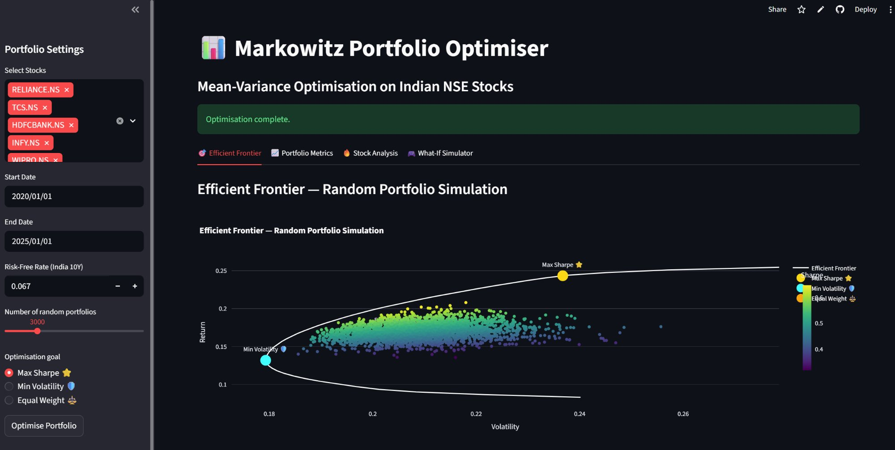
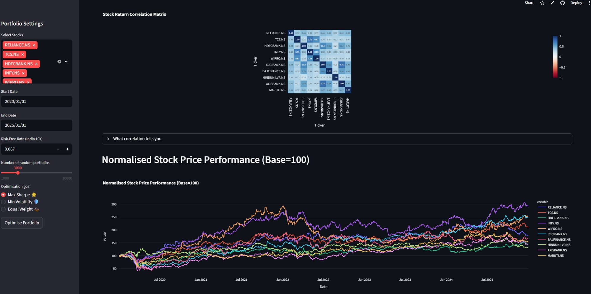

# 📊 Markowitz Portfolio Optimiser

> **Live Demo:** [markowitz-portfolio-optimiser.streamlit.app](https://markowitz-portfolio-optimiser.streamlit.app)  
> Built with Python · NumPy · SciPy · Plotly · yfinance · Streamlit

---

## 📸 Screenshots

### Efficient Frontier — Random Portfolio Simulation

*3,000 randomly generated portfolios coloured by Sharpe ratio. The white curve is the efficient frontier. Special portfolios marked: Max Sharpe ⭐ (gold), Min Volatility 🛡️ (cyan), Equal Weight ⚖️ (orange).*

### Stock Analysis — Correlation Matrix & Normalised Performance

*Correlation heatmap of all 10 NSE stocks + normalised price performance chart indexed to 100 at start date. Reveals diversification opportunities and relative stock performance.*

---

## 🚀 What Is This?

An interactive implementation of **Markowitz Mean-Variance Optimisation (1952)** applied to real Indian NSE stock data fetched live via yfinance.

The app generates thousands of random portfolios, computes the efficient frontier, and finds optimal allocations using scipy constrained optimisation — then backtests them against the Nifty 50.

---

## ✨ Features

| Tab | Description |
|-----|-------------|
| 🎯 **Efficient Frontier** | 3,000 simulated portfolios + frontier curve + 3 optimal portfolios marked |
| 📈 **Portfolio Metrics** | Annual return, volatility, Sharpe, Sortino, max drawdown, VaR 95% — all 3 strategies side by side + cumulative backtest vs Nifty 50 |
| 🔥 **Stock Analysis** | Correlation heatmap, normalised performance chart, return distributions |
| 🎮 **What-If Simulator** | Manual weight sliders with live updating metrics and frontier position |

---

## 🏦 Default Stock Universe (NSE)

```
RELIANCE.NS  TCS.NS  HDFCBANK.NS  INFY.NS  WIPRO.NS
ICICIBANK.NS  BAJFINANCE.NS  HINDUNILVR.NS  AXISBANK.NS  MARUTI.NS
```
All 10 stocks customisable. Date range, risk-free rate, and simulation count all adjustable.

---

## 🧱 Project Structure

```
markowitz-portfolio-optimiser/
├── app.py                      # Main Streamlit application
├── requirements.txt
└── src/
    ├── data_fetcher.py         # yfinance data fetching with st.cache_data
    ├── optimiser.py            # Random portfolios + Max Sharpe + Min Vol + Equal Weight
    ├── metrics.py              # Sharpe, Sortino, Max Drawdown, VaR 95%, cumulative returns
    └── efficient_frontier.py   # Frontier curve generation via constrained optimisation
```

---

## 📐 Mathematical Foundation

**Portfolio Return & Volatility:**
$$\mu_p = \mathbf{w}^\top \boldsymbol{\mu}, \quad \sigma_p = \sqrt{\mathbf{w}^\top \Sigma \mathbf{w}}$$

**Sharpe Ratio:**
$$S = \frac{\mu_p - r_f}{\sigma_p}$$

**Max Sharpe Optimisation (SLSQP):**
$$\max_{\mathbf{w}} \frac{\mathbf{w}^\top\boldsymbol{\mu} - r_f}{\sqrt{\mathbf{w}^\top\Sigma\mathbf{w}}} \quad \text{s.t.} \quad \sum w_i = 1,\ w_i \geq 0$$

**Value at Risk (Historical, 95%):**
$$\text{VaR}_{95\%} = -\text{Percentile}(r_p, 5)$$

---

## 🔧 Run Locally

```bash
git clone https://github.com/roy030407/markowitz-portfolio-optimiser
cd markowitz-portfolio-optimiser
pip install -r requirements.txt
streamlit run app.py
```

---

## 🎯 Why I Built This

This project applies **Modern Portfolio Theory** to real Indian market data — a practical implementation of the mathematical optimisation framework I study in my Mathematics & Computing degree at NIT Warangal.

Key concepts demonstrated:
- Mean-variance optimisation and the efficient frontier
- Constrained optimisation with scipy (SLSQP solver)
- Risk metrics: Sharpe ratio, Sortino ratio, maximum drawdown, historical VaR
- Portfolio backtesting and benchmark comparison

---

## 👤 Author

**Roy Harwani** — Mathematics & Computing (CGPA: 8.64), NIT Warangal  
📧 harwaniroy@gmail.com  
[](https://www.linkedin.com/in/roy-harwani-5030a6312/)
[](https://github.com/roy030407)

---

*If you find this useful, drop a ⭐ — it helps others discover it!*
